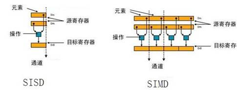
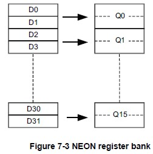
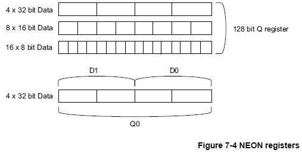

## SIMD及NEON概览

 https://zyddora.github.io/2016/02/28/neon_1/ 

### **SIMD**

 **Single Instruction Multiple Data (SIMD)**顾名思义就是“一**条指令处理多个数据**（一般是以2为底的指数数量）”的**并行处理**技术，相比于“**一条指令处理几个数据**”，运算速度将会大大提高。它是Michael J. Flynn在1966年定义的四种计算机架构之一（根据指令数与数据流的关系定义，其余还有SISD、MISD、MIMD）。 


 **许多程序需要处理大量的数据集，而且很多都是由少于32bits的位数来存储的。**比如在视频、图形、图像处理中的8-bit像素数据；音频编码中的16-bit采样数据等。在诸如上述的情形中，很可能**充斥着大量简单而重复的运算，且少有控制代码的出现**。因此，**SIMD就擅长为这类程序提供更高的性能**，比如下面几类： 

- Block-based data processing.
- Audio, video, and image processing codes.
- 2D graphics based on rectangular blocks of pixels.
- 3D graphics.
- Color-space conversion.
- Physics simulations.

 在32-bit内核的处理器上，如Cortex-A系列，如果不采用SIMD则会**将大量时间花费在处理8-bit或16-bit**的数据上，但是处理器本身的ALU、寄存器、数据深度又是主要为了32-bit的运算而设计的。**因此NEON应运而生。** 

###  关于SIMD和SISD 

Single Instruction Multiple Data，单指令多数据流。反之SISD是单指令单数据。以加法指令为例，单指令单数据（SISD）的CPU对加法指令译码后，执行部件先访问内存，取得第一个操作数；之后再一次访问内存，取得第二个操作数；随后才能进行求和运算。**而在SIMD型的CPU中，指令译码后几个执行部件同时访问内存，一次性获得所有操作数进行运算**。**这个特点使SIMD特别适合于多媒体应用等数据密集型运算**。如下图所示：



   ARM指令有16个32位通用寄存器，为r0-r15，其中r13为堆栈指针寄存器，r15为指令计算寄存器。实际可以使用的寄存器只有14个。r0-r3一般作为函数参数使用，函数返回值放在r0中。若函数参数超过4个，超过到参数压入堆栈。 

 

### **NEON**

NEON就是一种**基于SIMD思想的ARM技术**，相比于ARMv6或之前的架构，**NEON结合了64-bit和128-bit的SIMD指令集，提供128-bit宽的向量运算(vector operations)。**NEON技术从ARMv7开始被采用，目前可以在ARM Cortex-A和Cortex-R系列处理器中采用。

NEON在Cortex-A7、Cortex-A12、Cortex-A15处理器中被设置为默认选项，但是在其余的ARMv7 Cortex-A系列中是可选项。NEON与VFP共享了同样的寄存器，但它具有自己独立的执行流水线。

NEON SIMD **寄存器的长度是128位**，如果操作32位浮点数，可同时操作4个，如果操作16位整数（short），可同时操作8个；而如果操作8位整数，则可同时操作16个。可见，**选择合适的数据类型也是优化性能的重要方法之一**。

### **NEON架构（数据类型/寄存器/指令集）**

- 32-bit single precision floating-point 32-bit单精度浮点数；
- 8, 16, 32 and 64-bit unsigned and signed integers 8, 16, 32 and 64-bit无符号/有符号整型；
- 8 and 16-bit polynomials 8 and 16-bit多项式。

NEON数据类型说明符：

- Unsigned integer U8 U16 U32 U64
- Signed integer S8 S16 S32 S64
- Integer of unspecified type I8 I16 I32 I64
- Floating-point number F16 F32
- Polynomial over {0,1} P8

### **NEON寄存器（重点）**




**NEON寄存器有几种形式：**

- 16×128-bit寄存器(Q0-Q15)；
- 或32×64-bit寄存器(D0-D31)
- 或上述寄存器的组合。

 **每一个Q0-Q15寄存器映射到一对D寄存器。** 

 **寄存器之间的映射关系：** 

- D<2n> 映射到 Q 的最低有效半部；
- D<2n+1> 映射到 Q 的最高有效半部；

**结合NEON支持的数据类型，NEON寄存器有如下图的几种形态：**




使用NEON 指令读写数据时，不需要保证数据对其到16位。GCC支持的NEONE指令集的C语言接口（内置函数,intrinsic）声明在**arm_neon.h**头文件中。NEOE指令集支持的映射到向量寄存器的向量数据类型命名格式为

**type size x num.**

1. type 表示元素类型，**目前只支持float,int 和 unit.**

2. size表示**每个元素的数据长度位**数，float 只支持32位浮点数，int和unit支持8位，16位，32位，64位整数。

3. num表示元素数目，即向量寄存器的位数。由于NEONE只支持64位和128位向量寄存器，**故size 和 num的乘积只能是64或128**

   

### 应用实例

#### 	彩色图像转灰度图像

​	假设图像有256色，每个像素一个字节。原始的将RGB像素转换成灰度图像算法加法如下：

```c++
unsigned char gray= (unsigned char) (r*0.3f+g*0.59f+b*0.11f)
```

由于r,b,b为1个字节，因此编译器会插入指令将其优先转成浮点型，计算完成后再转整型。

权重采用int,变浮点数为定点

```c++
int r_ratio = 77;//0.3*256
int g_ratio = 151;//0.59*256
int b_ratio = 28;//0.11*256
int temp = r*r_ratio + g*g_ration+ b*b_ration;
unsigned char gray = temp/256;

```

最终结果：

```c++
for(int i =0; i< n ;i++){
   int r = *src++;//red
   int g = *src++;//green
   int b = *src++;//blue
   int r_ratio = 77; 
   int g_ratio = 151;
   int b_ratio = 28;
   int temp = r*r_ratio;
   tem +=(g*g_ratio);
   temp+=(b*b_ratio);
   dest[i] = (temp>>8);// 除以256
}
```


