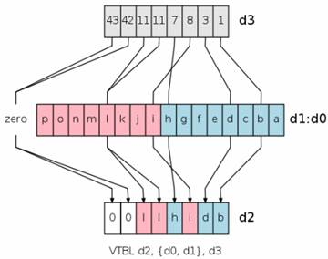

## ARM和NEON指令

 https://blog.csdn.net/chshplp_liaoping/article/details/12752749 

 在移动平台上进行一些复杂算法的开发，**一般需要用到指令集来进行加速**。目前在移动上使用最多的是ARM芯片。 

ARM是微处理器行业的一家知名企业，其芯片结构有：armv5、armv6、armv7和armv8系列。芯片类型有：**arm7、arm9、arm11、cortex**系列。指令集有：**armv5、armv6和neon指令**。关于ARM到知识参考：http://baike.baidu.com/view/11200.htm


最初的ARM指令集为通用计算型指令集，**指令集都是针对单个数据进行计算，没有并行计算到功能**。随着版本的更新，后面逐渐加入了一些**复杂到指令以及并行计算到指令**。而NEON指令是**专门针对大规模到并行运算而设计**的。 


 NEON 技术可加速多媒体和信号处理算法（如视频编码/解码、2D/3D 图形、游戏、音频和语音处理、图像处理技术、电话和声音合成），其性能至少为ARMv5 性能的3倍，为 [ARMv6](http://www.arm.com/zh/products/processors/instruction-set-architectures/index.php) SIMD性能的2倍 

如何才能快速到写出高效的指令代码？这就需要对各个指令比较熟悉，知道各个指令的使用规范和使用场合。

 ARM指令有16个32位通用寄存器，**为r0-r15**，其中r13为堆栈指针寄存器，**r15为指令计算寄存器**。实际可以使用的寄存器**只有14个**。**r0-r3一般作为函数参数使用**，函数返**回值放在r0中**。若函数参数超过4个，**超过**到**参数压入堆栈**。 

 **NEON指令，目前使用较多。而且使用难度也较大**

 **NEON的寄存器：** (见笔记 ARM_NEON_SIMD)

 有16个128位四字到寄存器Q0-Q15，32个64位双子寄存器D0-D31，两个寄存器是重叠的，在使用到时候需要特别注意，不小心就会覆盖掉。 

 **NEON的数据类型：** 

 注意数据类型**针对到时操作数**，而不是目标数，这点在写的时候要特别注意，很容易搞错，尤其是对那些长指令宽指令的时候，因为经常Q和D一起操作。 


 **NEON中的正常指令、宽指令、窄指令、饱和指令、长指令** 

**正常指令**：生成大小**相同且类型通常与操作数向量相同**到结果向量

**长指令**：对双字向量操作数执行运算，生产四字向量到结果。**所生成的元素一般是操作数元素宽度到两倍，并属于同一类型。L标记**，如VMOVL。

**宽指令**：一个双字向量操作数和一个四字向量操作数执行运算，生成四字向量结果。W标记，如VADDW。

**窄指令**：四字向量操作数执行运算，并生成双字向量结果，**所生成的元素一般是操作数元素宽度的一半**。**N标记，**如VMOVN。

饱和指令：当**超过数据类型指定到范围则自动限制在该范围内**。Q标记，如VQSHRUN

**什么是立即数**：

汇编语言中操作数有三种：**寄存器操作数、存储器操作数和立即数。**
**其中立即数相当于高级语言中的常量**（常数），**它是直接出现在指令中的数**，不用存储在寄存器或存储器中的数，如指令ADD AL,06H中的06H即为立即数。 

###  **NEON常见指令** 

####  **复制指令：** 

 **VMOV**： 

**两个arm寄存器和d之间**

vmov d0, r0, r1：将r1的内容送到**d0到低半部分**，r0的内容送到**d0到高半部分**

vmov r0, r1, d0：**将d0的低半部分送到r0，d0的高半部分内容送到r**1

**一个arm寄存器和d之间**

vmov.U32 d0[0], r0：将r0的内容送到d0[0]中，d0[0]指d0到低32位

vmov.U32 r0, d0[0]：将d0[0]的内容送到r0中

**立即数**： 

 vmov.U16 d0, #1：将立即数1赋值给d0的每个16位 

 vmov.U32 q0, #1：将立即数1赋值给q0的每个32位 

 **长指令：**

VMOVL：d赋值给q 

vmovl.U16 q0, d0：将d0的每个16位数据赋值到q0的每个32位数据中 

 **窄指令**：

VMOVN：q赋值给d 

 vmovn.I32 d0, q0：将q0的每32位数据赋值到q0的每16位数据中 

**饱和指令：**

VQMOVN等，饱和到指定的数据类型 

  vqmovun.S32 d0, q0：将q0到每个32位移动到d0中到每个16位中，范围是0-65535 

**VDUP：**

VDUP.8 d0, r0：将r0复制到d0中，8位

VDUP.16 q0, r0：将r0复制到q0中，16位

VDUP.32 q0, d2[0]：将d2的一半复制到q0中

VDUP.32 d0, d2[1]：将d2的一半复制到d0中

注意是vdup可以将r寄存器中的内容复制到整个neon寄存器中**，不能将立即数进行vdup，立即数只能用vmov**


####  **逻辑运算**

 VADD：按位与；VBIC：位清除；VEOR：按位异或；VORN：按位或非；VORR：按位或 

####  **移位指令：** 

VSHL：左移、VSHLL：左移扩展、VQSHL：左移饱和、VQSHLU：无符号左移饱和扩展

VSHR：右移、VSHRN：右移窄、VRSHR：右移舍入、VQSHRUN：无符号右移饱和舍入

####  **通用算术指令：** 

VABA：绝对值累加、VABD：绝对值相加、VABS：绝对值、VNEG：求反、VADD、VADDW、VADDL、VSUB、VSUBL、VSUBW：加减

VPADD：将两个向量的相邻元素相加

如VPADD.I16 {d2}, d0, d1


 VPADDL：VPADDL.S16 d0, d1 


 VMAX：最大值，VMIN：最小值 

 VMUL、VMULL、VMLA（乘加）、VMLS（乘减）

####  **加载存储指令** 

 **VLD和VST** 


 **VREV反转元素指令**： 

​		

 **VEXT移位指令**： 


 **VTRN转置指令：可以用于矩阵的转置** 

​					


 **VZIP指令：压缩，类似交叉存取** 


 **VUZP指令：解压操作，类似交叉存取** 


 **VTBL查表指令：从d0，d1中查找d3中的索引值，如果找到则取出，没有找到则为0，存入d2中** 



### 需要注意的地方

    load数据的时候，第一次load会把数据放在cache里面，只要不超过cache的大小，下一次load同样数据的时候，则会比第一次load要快很多，会直接从cache中load数据，这样在汇编程序设计的时候是非常需要考虑的问题。
    
     如：求取一个图像的均值，8*8的窗口，先行求和，然后列求和出来均值，这时候会有两个函数，数据会加载两遍，如果按照这样去优化的话则优化不了多少。如果换成上面这种思路，先做行16行，然后再做列，这样数据都在cache里面，做列的时候load数据会很快。

   在做neon乘法指令的时候会有大约2个clock的阻塞时间，如果你要立即使用乘法的结果，则就会阻塞在这里，在写neon指令的时候需要特别注意。乘法的结果不能立即使用，可以将一些其他的操作插入到乘法后面而不会有时间的消耗。

如：vmul.u16 q1, d3, d4 

         vadd.u32 q1, q2, q3

此时直接使用乘法的结果q1则会阻塞，执行vadd需要再等待2个clock的时间

使用饱和指令的时候，如乘法饱和的时候，在做乘法后会再去做一次饱和，所以时间要比直接做乘法要慢。

如：  vmul.u16 q1, d3, d4

          vqmul.u32 q1, q2, q3

后一个的时间要比第一个的时间要久。

在对16位数据进行load或者store操作的时候，需要注意的是字节移位。比如是16位数据，则load 8个16位数据，如果指定寄存器进行偏移，此时需要特别注意。

例如：vld1.64 {d0}, [r0], r1

## **加法**

 使用的话，编译器要加`"-mfloat-abi=softfp -mfpu=neon"`编译选项 

####  **普通加法**  共18个 

 函数名组成：
"vaddq" = "v" + "add" + "q"。
"v" = "vector"，向量。
"add" = 加法。
"q" = QWORD，全字。 

```c++
//共64位宽度的  源向量和目标向量都为64 dt为空
int8x8_t    vadd_s8  (int8x8_t   , int8x8_t   );
int16x4_t   vadd_s16 (int16x4_t  , int16x4_t  );
int32x2_t   vadd_s32 (int32x2_t  , int32x2_t  );
int64x1_t   vadd_s64 (int64x1_t  , int64x1_t  );
uint8x8_t   vadd_u8  (uint8x8_t  , uint8x8_t  );
uint16x4_t  vadd_u16 (uint16x4_t , uint16x4_t );
uint32x2_t  vadd_u32 (uint32x2_t , uint32x2_t );
uint64x1_t  vadd_u64 (uint64x1_t , uint64x1_t );
float32x2_t vadd_f32 (float32x2_t, float32x2_t);

//共128位宽度的 源向量和目标向量都是128 dt 为q
int8x16_t   vaddq_s8  (int8x16_t  , int8x16_t  );
int16x8_t   vaddq_s16 (int16x8_t  , int16x8_t  );
int32x4_t   vaddq_s32 (int32x4_t  , int32x4_t  );
int64x2_t   vaddq_s64 (int64x2_t  , int64x2_t  );
uint8x16_t  vaddq_u8  (uint8x16_t , uint8x16_t );
uint16x8_t  vaddq_u16 (uint16x8_t , uint16x8_t );
uint32x4_t  vaddq_u32 (uint32x4_t , uint32x4_t );
uint64x2_t  vaddq_u64 (uint64x2_t , uint64x2_t );
float32x4_t vaddq_f32 (float32x4_t, float32x4_t);
```

####  **饱和指令加法** 

 共16个。例如8位有符号的运算，`30 + 60 = 90`，`100 + 50 = 127`，`(-100) + (-60) = -128`。 
 函数名组成： 

 "vqaddq" = "v" + "q" + "add" + "q"。 

 "v" = "vector"，向量。
"q" = 饱和。
"add" = 加法。
"q" = QWORD，全字。 

```c++
//共64位宽度的
int8x8_t   vqadd_s8  (int8x8_t  , int8x8_t  );
int16x4_t  vqadd_s16 (int16x4_t , int16x4_t );
int32x2_t  vqadd_s32 (int32x2_t , int32x2_t );
int64x1_t  vqadd_s64 (int64x1_t , int64x1_t );
uint8x8_t  vqadd_u8  (uint8x8_t , uint8x8_t );
uint16x4_t vqadd_u16 (uint16x4_t, uint16x4_t);
uint32x2_t vqadd_u32 (uint32x2_t, uint32x2_t);
uint64x1_t vqadd_u64 (uint64x1_t, uint64x1_t);

//共128位宽度的
int8x16_t  vqaddq_s8  (int8x16_t , int8x16_t );
int16x8_t  vqaddq_s16 (int16x8_t , int16x8_t );
int32x4_t  vqaddq_s32 (int32x4_t , int32x4_t );
int64x2_t  vqaddq_s64 (int64x2_t , int64x2_t );
uint8x16_t vqaddq_u8  (uint8x16_t, uint8x16_t);
uint16x8_t vqaddq_u16 (uint16x8_t, uint16x8_t);
uint32x4_t vqaddq_u32 (uint32x4_t, uint32x4_t);
uint64x2_t vqaddq_u64 (uint64x2_t, uint64x2_t);
```

####  **减半加法**

共12个。用于求平均值，可理解为 `a = (b + c) / 2`。 

函数名组成：
 "vhaddq" = "v" + "h" + "add" + "q"。
 "v" = "vector"，向量。
 "h" = "halving"，一半的。
 "add" = 加法。
 "q" = QWORD，全字。

```c++
//共64位宽度的
int8x8_t   vhadd_s8  (int8x8_t  , int8x8_t  );
int16x4_t  vhadd_s16 (int16x4_t , int16x4_t );
int32x2_t  vhadd_s32 (int32x2_t , int32x2_t );
uint8x8_t  vhadd_u8  (uint8x8_t , uint8x8_t );
uint16x4_t vhadd_u16 (uint16x4_t, uint16x4_t);
uint32x2_t vhadd_u32 (uint32x2_t, uint32x2_t);

//共128位宽度的
int8x16_t  vhaddq_s8  (int8x16_t , int8x16_t );
int16x8_t  vhaddq_s16 (int16x8_t , int16x8_t );
int32x4_t  vhaddq_s32 (int32x4_t , int32x4_t );
uint8x16_t vhaddq_u8  (uint8x16_t, uint8x16_t);
uint16x8_t vhaddq_u16 (uint16x8_t, uint16x8_t);
uint32x4_t vhaddq_u32 (uint32x4_t, uint32x4_t);
```

####  **带四舍五入的减半加法** 

12个。用于求平均值，可理解为 `a = (b + c + 1) / 2`。
 函数名组成：
 "vrhaddq" = "v" + "r" + "h" + "add" + "q"。
 "v" = "vector"，向量。
 "r" = "rounding"，舍入。
 "h" = "halving"，一半的。
 "add" = 加法。
 "q" = QWORD，全字。

```c++
//共64位宽度的
int8x8_t   vrhadd_s8  (int8x8_t  , int8x8_t  );
int16x4_t  vrhadd_s16 (int16x4_t , int16x4_t );
int32x2_t  vrhadd_s32 (int32x2_t , int32x2_t );
uint8x8_t  vrhadd_u8  (uint8x8_t , uint8x8_t );
uint16x4_t vrhadd_u16 (uint16x4_t, uint16x4_t);
uint32x2_t vrhadd_u32 (uint32x2_t, uint32x2_t);

//共128位宽度的
int8x16_t  vrhaddq_s8  (int8x16_t , int8x16_t );
int16x8_t  vrhaddq_s16 (int16x8_t , int16x8_t );
int32x4_t  vrhaddq_s32 (int32x4_t , int32x4_t );
uint8x16_t vrhaddq_u8  (uint8x16_t, uint8x16_t);
uint16x8_t vrhaddq_u16 (uint16x8_t, uint16x8_t);
uint32x4_t vrhaddq_u32 (uint32x4_t, uint32x4_t);
```

####  **长指令加法**

共6个。运算结果的宽度翻倍。 

 函数名组成：
"vaddl" = "v" + "add" + "l"。
"v" = "vector"，向量。
"add" = 加法。
"l" = "long"，长指令。 

```c++
int16x8_t  vaddl_s8  (int8x8_t  , int8x8_t  ); //源向量长度为64位 目标向量为128位 dt为字母l
int32x4_t  vaddl_s16 (int16x4_t , int16x4_t );
int64x2_t  vaddl_s32 (int32x2_t , int32x2_t );
uint16x8_t vaddl_u8  (uint8x8_t , uint8x8_t );
uint32x4_t vaddl_u16 (uint16x4_t, uint16x4_t);
uint64x2_t vaddl_u32 (uint32x2_t, uint32x2_t);
```

####  **宽指令加法**

共6个。操作数宽度不等。 

 函数名组成：
"vaddw" = "v" + "add" + "w"。
"v" = "vector"，向量。
"add" = 加法。
"w" = "wide"，宽指令。 

```c++
int16x8_t  vaddw_s8  (int16x8_t , int8x8_t  );//多个源向量长度不一致且都不大于目标向量长度（一个源向量长度为64位，另一个为128位，目标向量长度为128位）dt 为w
int32x4_t  vaddw_s16 (int32x4_t , int16x4_t );
int64x2_t  vaddw_s32 (int64x2_t , int32x2_t );
uint16x8_t vaddw_u8  (uint16x8_t, uint8x8_t );
uint32x4_t vaddw_u16 (uint32x4_t, uint16x4_t);
uint64x2_t vaddw_u32 (uint64x2_t, uint32x2_t);
```

####  **窄指令加法**

共6个。结果的宽度减半，舍弃低位。假如b和c是16位无符号整数，可以理解为`(b+c)>>8`。 

 函数名组成：
"vaddhn" = "v" + "add" + "hn"。
"v" = "vector"，向量。
"add" = 加法。
"hn" = High half，窄指令。

```c++
int8x8_t   vaddhn_s16 (int16x8_t , int16x8_t );
int16x4_t  vaddhn_s32 (int32x4_t , int32x4_t );
int32x2_t  vaddhn_s64 (int64x2_t , int64x2_t );
uint8x8_t  vaddhn_u16 (uint16x8_t, uint16x8_t);
uint16x4_t vaddhn_u32 (uint32x4_t, uint32x4_t);
uint32x2_t vaddhn_u64 (uint64x2_t, uint64x2_t);
```

####  **带四舍五入的窄指令加法** 

 共6个。假如b和c是16位无符号整数，可以理解为`(b+c+128)>>8` 

函数名组成：
 "vraddhn" = "v" + "r" + "add" + "hn"。
 "v" = "vector"，向量。
 "r" = "rounding"，舍入。
 "add" = 加法。
 "hn" = High half，窄指令。

```c++
int8x8_t   vraddhn_s16 (int16x8_t , int16x8_t );
int16x4_t  vraddhn_s32 (int32x4_t , int32x4_t );
int32x2_t  vraddhn_s64 (int64x2_t , int64x2_t );
uint8x8_t  vraddhn_u16 (uint16x8_t, uint16x8_t);
uint16x4_t vraddhn_u32 (uint32x4_t, uint32x4_t);
uint32x2_t vraddhn_u64 (uint64x2_t, uint64x2_t);
```

###  **乘法系列** 

####  **普通乘法** 

普通乘法的操作数等宽，所以**有溢出的可能**。
 函数名组成：
 "vmulq" = "v" + "mul" + "q"。
 "v" = "vector"，向量。
 "mul" = 乘法。
 "q" = QWORD，全字，128位。

```c++
//共64位宽度的
int8x8_t    vmul_s8  (int8x8_t   , int8x8_t   );
int16x4_t   vmul_s16 (int16x4_t  , int16x4_t  );
int32x2_t   vmul_s32 (int32x2_t  , int32x2_t  );
uint8x8_t   vmul_u8  (uint8x8_t  , uint8x8_t  );
uint16x4_t  vmul_u16 (uint16x4_t , uint16x4_t );
uint32x2_t  vmul_u32 (uint32x2_t , uint32x2_t );
poly8x8_t   vmul_p8  (poly8x8_t  , poly8x8_t  );
float32x2_t vmul_f32 (float32x2_t, float32x2_t);
//共128位宽度的 源向量和目标向量都是128 dt 为q
int8x16_t   vmulq_s8  (int8x16_t  , int8x16_t  );
int16x8_t   vmulq_s16 (int16x8_t  , int16x8_t  );
int32x4_t   vmulq_s32 (int32x4_t  , int32x4_t  );
uint8x16_t  vmulq_u8  (uint8x16_t , uint8x16_t );
uint16x8_t  vmulq_u16 (uint16x8_t , uint16x8_t );
uint32x4_t  vmulq_u32 (uint32x4_t , uint32x4_t );
poly8x16_t  vmulq_p8  (poly8x16_t , poly8x16_t );
float32x4_t vmulq_f32 (float32x4_t, float32x4_t);
```

####  **长指令乘法** 

长指令的结果的宽度翻倍，**所以不会溢出。**
 函数名组成：
 "vmull" = "v" + "mul" + "l"。
 "v" = "vector"，向量。
 "mul" = 乘法。
 "l" = long，长指令。

```c++
int16x8_t  vmull_s8  (int8x8_t  , int8x8_t  ); //目标向量长度比源向量长度大，源向量长度为64位 目标向量为128位 dt为字母l
int32x4_t  vmull_s16 (int16x4_t , int16x4_t );
int64x2_t  vmull_s32 (int32x2_t , int32x2_t );
uint16x8_t vmull_u8  (uint8x8_t , uint8x8_t );
uint32x4_t vmull_u16 (uint16x4_t, uint16x4_t);
uint64x2_t vmull_u32 (uint32x2_t, uint32x2_t);
poly16x8_t vmull_p8  (poly8x8_t , poly8x8_t ); //poly 不常用
```

####  **饱和双倍长指令乘法** 

 相当于将**长指令乘法**的结果再乘以2，**此时可能会溢出，所以才有取饱和一说**，可以理解为`a = 饱和(b * c * 2)`。 

函数名组成：
 "vqdmull" = "v" + "q" + "d" + "mul" + "l"。
 "v" = "vector"，向量。
 "q" = 饱和。
 "d" = "doubling"，双倍。
 "mul" = 乘法。
 "l" = long，长指令

```c++
int32x4_t vqdmull_s16 (int16x4_t, int16x4_t);
int64x2_t vqdmull_s32 (int32x2_t, int32x2_t);
```

####  **饱和双倍取高位乘法** 

 相当于取**饱和双倍长指令乘法**高位的那一半，假如b和c是16位的话，可以理解为`a = 饱和(b * c * 2) >> 16`。
函数名组成： 

"vqdmulhq" = "v" + "q" + "d" + "mul" + "h" + "q"。
 "v" = "vector"，向量。
 "q" = 饱和。
 "d" = "doubling"，双倍。
 "mul" = 乘法。
 "h" = "high"，高位。
 "q" = QWORD，全字，128位

```cpp
int16x4_t vqdmulh_s16  (int16x4_t, int16x4_t);
int32x2_t vqdmulh_s32  (int32x2_t, int32x2_t);
int16x8_t vqdmulhq_s16 (int16x8_t, int16x8_t);
int32x4_t vqdmulhq_s32 (int32x4_t, int32x4_t);
```

####  **饱和双倍四舍五入取高位乘法** 

 相当于有四舍五入功能的**饱和双倍取高位乘法**，假如b和c是16位的话，可以理解为`a = 饱和(b * c * 2 + 32768) >> 16`。 

函数名组成：
 "vqrdmulhq" = "v" + "r" + "q" + "d" + "mul" + "h" + "q"。
 "v" = "vector"，向量。
 "r" = "rounding"，舍入。
 "q" = 饱和。
 "d" = "doubling"，双倍。
 "mul" = 乘法。
 "h" = "high"，高位。
 "q" = QWORD，全字，128位。

```c++
int16x4_t vqrdmulh_s16  (int16x4_t, int16x4_t);
int32x2_t vqrdmulh_s32  (int32x2_t, int32x2_t);
int16x8_t vqrdmulhq_s16 (int16x8_t, int16x8_t);
int32x4_t vqrdmulhq_s32 (int32x4_t, int32x4_t);
```

####  **带加法的乘法** 

有可能会溢出，可以理解为`a = b + c * d`。
 函数名组成：
 "vmlaq" = "v" + "ml" + "a" + "q"。
 "v" = "vector"，向量。
 "ml" = 乘法。
 "a" = "add"，加法。
 "q" = QWORD，全字，128位。

```c++
//共64位宽度的
int8x8_t    vmla_s8  (int8x8_t   , int8x8_t   , int8x8_t   );
int16x4_t   vmla_s16 (int16x4_t  , int16x4_t  , int16x4_t  );
int32x2_t   vmla_s32 (int32x2_t  , int32x2_t  , int32x2_t  );
uint8x8_t   vmla_u8  (uint8x8_t  , uint8x8_t  , uint8x8_t  );
uint16x4_t  vmla_u16 (uint16x4_t , uint16x4_t , uint16x4_t );
uint32x2_t  vmla_u32 (uint32x2_t , uint32x2_t , uint32x2_t );
float32x2_t vmla_f32 (float32x2_t, float32x2_t, float32x2_t);
//共128位宽度的
int8x16_t   vmlaq_s8  (int8x16_t  , int8x16_t  , int8x16_t  );
int16x8_t   vmlaq_s16 (int16x8_t  , int16x8_t  , int16x8_t  );
int32x4_t   vmlaq_s32 (int32x4_t  , int32x4_t  , int32x4_t  );
uint8x16_t  vmlaq_u8  (uint8x16_t , uint8x16_t , uint8x16_t );
uint16x8_t  vmlaq_u16 (uint16x8_t , uint16x8_t , uint16x8_t );
uint32x4_t  vmlaq_u32 (uint32x4_t , uint32x4_t , uint32x4_t );
float32x4_t vmlaq_f32 (float32x4_t, float32x4_t, float32x4_t);
```


####  **带加法的长指令乘法** 

乘法部分不会溢出，但是加法部分可能会溢出，可以理解为`a = b + c * d`。
 函数名组成：
 "vmlaq" = "v" + "ml" + "a" + "l"。
 "v" = "vector"，向量。
 "ml" = 乘法。
 "a" = "add"，加法。
 "l" = long，长指令。

```cpp
int16x8_t  vmlal_s8  (int16x8_t , int8x8_t  , int8x8_t  );
int32x4_t  vmlal_s16 (int32x4_t , int16x4_t , int16x4_t );
int64x2_t  vmlal_s32 (int64x2_t , int32x2_t , int32x2_t );
uint16x8_t vmlal_u8  (uint16x8_t, uint8x8_t , uint8x8_t );
uint32x4_t vmlal_u16 (uint32x4_t, uint16x4_t, uint16x4_t);
uint64x2_t vmlal_u32 (uint64x2_t, uint32x2_t, uint32x2_t);
```

####  **带加法的饱和双倍长指令乘法** 

可理解为`a = 饱和(b + c * d * 2)`。
 函数名组成：
 "vqdmlal" = "v" + "q" + "d" + "ml" + "a" + "l"。
 "v" = "vector"，向量。
 "q" = 饱和。
 "d" = "doubling"，双倍。
 "ml" = 乘法。
 "a" = "add"，加法。
 "l" = long，长指令。

```c++
int32x4_t vqdmlal_s16 (int32x4_t, int16x4_t, int16x4_t);
int64x2_t vqdmlal_s32 (int64x2_t, int32x2_t, int32x2_t);
```

####  **带减法的乘法** 

 可理解为`a = b - c * d`。 

函数名组成：
 "vmlsq" = "v" + "ml" + "s" + "q"。
 "v" = "vector"，向量。
 "ml" = 乘法。
 "s" = "sub"，减法。
 "q" = QWORD，全字，128位。


```c++
//共64位宽度的
int8x8_t    vmls_s8  (int8x8_t   , int8x8_t   , int8x8_t   );
int16x4_t   vmls_s16 (int16x4_t  , int16x4_t  , int16x4_t  );
int32x2_t   vmls_s32 (int32x2_t  , int32x2_t  , int32x2_t  );
uint8x8_t   vmls_u8  (uint8x8_t  , uint8x8_t  , uint8x8_t  );
uint16x4_t  vmls_u16 (uint16x4_t , uint16x4_t , uint16x4_t );
uint32x2_t  vmls_u32 (uint32x2_t , uint32x2_t , uint32x2_t );
float32x2_t vmls_f32 (float32x2_t, float32x2_t, float32x2_t);
//共128位宽度的
int8x16_t   vmlsq_s8  (int8x16_t  , int8x16_t  , int8x16_t  );
int16x8_t   vmlsq_s16 (int16x8_t  , int16x8_t  , int16x8_t  );
int32x4_t   vmlsq_s32 (int32x4_t  , int32x4_t  , int32x4_t  );
uint8x16_t  vmlsq_u8  (uint8x16_t , uint8x16_t , uint8x16_t );
uint16x8_t  vmlsq_u16 (uint16x8_t , uint16x8_t , uint16x8_t );
uint32x4_t  vmlsq_u32 (uint32x4_t , uint32x4_t , uint32x4_t );
float32x4_t vmlsq_f32 (float32x4_t, float32x4_t, float32x4_t);
```

####  **带减法的长指令乘法** 

可理解为`a = b - c * d`。
 函数名组成：
 "vmlsl" = "v" + "ml" + "s" + "l"。
 "v" = "vector"，向量。
 "ml" = 乘法。
 "s" = "sub"，减法。
 "l" = long，长指令。


```cpp
int16x8_t  vmlsl_s8  (int16x8_t , int8x8_t  , int8x8_t  );
int32x4_t  vmlsl_s16 (int32x4_t , int16x4_t , int16x4_t );
int64x2_t  vmlsl_s32 (int64x2_t , int32x2_t , int32x2_t );
uint16x8_t vmlsl_u8  (uint16x8_t, uint8x8_t , uint8x8_t );
uint32x4_t vmlsl_u16 (uint32x4_t, uint16x4_t, uint16x4_t);
uint64x2_t vmlsl_u32 (uint64x2_t, uint32x2_t, uint32x2_t);
```

####  **带减法的饱和双倍长指令乘法** 

可理解为`a = 饱和(b - c * d * 2)`。
 函数名组成：
 "vqdmlsl" = "v" + "q" + "d" + "ml" + "s" + "l"。
 "v" = "vector"，向量。
 "q" = 饱和。
 "d" = "doubling"，双倍。
 "ml" = 乘法。
 "s" = "sub"，减法。
 "l" = long，长指令。

```c++
int32x4_t vqdmlsl_s16 (int32x4_t, int16x4_t, int16x4_t);
int64x2_t vqdmlsl_s32 (int64x2_t, int32x2_t, int32x2_t);
```

###  **减法系列** 

####  **普通减法** 

 函数名组成：
"vsubq" = "v" + "sub" + "q"。
"v" = "vector"，向量。
"sub" = 减法。
"q" = QWORD，全字，128位。 

```c++
//共64位宽度的
int8x8_t    vsub_s8  (int8x8_t   , int8x8_t   );
int16x4_t   vsub_s16 (int16x4_t  , int16x4_t  );
int32x2_t   vsub_s32 (int32x2_t  , int32x2_t  );
int64x1_t   vsub_s64 (int64x1_t  , int64x1_t  );
uint8x8_t   vsub_u8  (uint8x8_t  , uint8x8_t  );
uint16x4_t  vsub_u16 (uint16x4_t , uint16x4_t );
uint32x2_t  vsub_u32 (uint32x2_t , uint32x2_t );
uint64x1_t  vsub_u64 (uint64x1_t , uint64x1_t );
float32x2_t vsub_f32 (float32x2_t, float32x2_t);
//共128位宽度的
int8x16_t   vsubq_s8  (int8x16_t  , int8x16_t  );
int16x8_t   vsubq_s16 (int16x8_t  , int16x8_t  );
int32x4_t   vsubq_s32 (int32x4_t  , int32x4_t  );
int64x2_t   vsubq_s64 (int64x2_t  , int64x2_t  );
uint8x16_t  vsubq_u8  (uint8x16_t , uint8x16_t );
uint16x8_t  vsubq_u16 (uint16x8_t , uint16x8_t );
uint32x4_t  vsubq_u32 (uint32x4_t , uint32x4_t );
uint64x2_t  vsubq_u64 (uint64x2_t , uint64x2_t );
float32x4_t vsubq_f32 (float32x4_t, float32x4_t);
```

####  **长指令减法** 

 函数名组成：
"vsubl" = "v" + "sub" + "l"。
"v" = "vector"，向量。
"sub" = 减法。
"l" = long，长指令。 

```c++
int16x8_t  vsubl_s8  (int8x8_t  , int8x8_t  );
int32x4_t  vsubl_s16 (int16x4_t , int16x4_t );
int64x2_t  vsubl_s32 (int32x2_t , int32x2_t );
uint16x8_t vsubl_u8  (uint8x8_t , uint8x8_t );
uint32x4_t vsubl_u16 (uint16x4_t, uint16x4_t);
uint64x2_t vsubl_u32 (uint32x2_t, uint32x2_t);
```

####  **宽指令减法** 

 函数名组成：
"vsubl" = "v" + "sub" + "w"。
"v" = "vector"，向量。
"sub" = 减法。
"w" = "wide"，宽指令。 

```c++
int16x8_t  vsubw_s8  (int16x8_t , int8x8_t  );
int32x4_t  vsubw_s16 (int32x4_t , int16x4_t );
int64x2_t  vsubw_s32 (int64x2_t , int32x2_t );
uint16x8_t vsubw_u8  (uint16x8_t, uint8x8_t );
uint32x4_t vsubw_u16 (uint32x4_t, uint16x4_t);
uint64x2_t vsubw_u32 (uint64x2_t, uint32x2_t);
```

####  **减半减法** 

结果值再减半，可以理解为`a = (b - c) / 2`。
 函数名组成：
 "vhsubq" = "v" + "h" + "sub" + "q"。
 "v" = "vector"，向量。
 "h" = "halving"，一半的。
 "sub" = 减法。
 "q" = QWORD，全字，128位。

```c++
//共64位宽度的
int8x8_t   vhsub_s8   (int8x8_t  , int8x8_t  );
int16x4_t  vhsub_s16  (int16x4_t , int16x4_t );
int32x2_t  vhsub_s32  (int32x2_t , int32x2_t );
uint8x8_t  vhsub_u8   (uint8x8_t , uint8x8_t );
uint16x4_t vhsub_u16  (uint16x4_t, uint16x4_t);
uint32x2_t vhsub_u32  (uint32x2_t, uint32x2_t);
//共128位宽度的
int8x16_t  vhsubq_s8  (int8x16_t , int8x16_t );
int16x8_t  vhsubq_s16 (int16x8_t , int16x8_t );
int32x4_t  vhsubq_s32 (int32x4_t , int32x4_t );
uint8x16_t vhsubq_u8  (uint8x16_t, uint8x16_t);
uint16x8_t vhsubq_u16 (uint16x8_t, uint16x8_t);
uint32x4_t vhsubq_u32 (uint32x4_t, uint32x4_t);
```

####  **饱和指令减法** 	

函数名组成：
 "vqsubq" = "v" + "q" + "sub" + "q"。
 "v" = "vector"，向量。
 "q" = 饱和。
 "sub" = 减法。
 "q" = QWORD，全字，128位。

```c++
//共64位宽度的
int8x8_t   vqsub_s8  (int8x8_t  , int8x8_t  );
int16x4_t  vqsub_s16 (int16x4_t , int16x4_t );
int32x2_t  vqsub_s32 (int32x2_t , int32x2_t );
int64x1_t  vqsub_s64 (int64x1_t , int64x1_t );
uint8x8_t  vqsub_u8  (uint8x8_t , uint8x8_t );
uint16x4_t vqsub_u16 (uint16x4_t, uint16x4_t);
uint32x2_t vqsub_u32 (uint32x2_t, uint32x2_t);
uint64x1_t vqsub_u64 (uint64x1_t, uint64x1_t);
//共128位宽度的
int8x16_t  vqsubq_s8  (int8x16_t , int8x16_t );
int16x8_t  vqsubq_s16 (int16x8_t , int16x8_t );
int32x4_t  vqsubq_s32 (int32x4_t , int32x4_t );
int64x2_t  vqsubq_s64 (int64x2_t , int64x2_t );
uint8x16_t vqsubq_u8  (uint8x16_t, uint8x16_t);
uint16x8_t vqsubq_u16 (uint16x8_t, uint16x8_t);
uint32x4_t vqsubq_u32 (uint32x4_t, uint32x4_t);
uint64x2_t vqsubq_u64 (uint64x2_t, uint64x2_t);
```

####  **窄指令减法** 

保留结果的高位那一半，假设b和c是16位的数，那么可以理解为 `a = (b - c) >> 8`。
 函数名组成：
 "vsubhn" = "v" + "sub" + "hn"。
 "v" = "vector"，向量。
 "sub" = 减法。
 "hn" = High half，窄指令。

```c++
int8x8_t   vsubhn_s16 (int16x8_t , int16x8_t );
int16x4_t  vsubhn_s32 (int32x4_t , int32x4_t );
int32x2_t  vsubhn_s64 (int64x2_t , int64x2_t );
uint8x8_t  vsubhn_u16 (uint16x8_t, uint16x8_t);
uint16x4_t vsubhn_u32 (uint32x4_t, uint32x4_t);
uint32x2_t vsubhn_u64 (uint64x2_t, uint64x2_t);
```

####  **带四舍五入的窄指令减法** 

保留结果的高位那一半，假设b和c是16位的数，那么可以理解为 `a = 四舍五入((b - c) >> 8)`。
 函数名组成：
 "vrsubhn" = "v" + "r" + "sub" + "hn"。
 "v" = "vector"，向量。
 "r" = "rounding"，舍入。
 "sub" = 减法。
 "hn" = High half，窄指令。

```c++
int8x8_t   vrsubhn_s16 (int16x8_t , int16x8_t );
int16x4_t  vrsubhn_s32 (int32x4_t , int32x4_t );
int32x2_t  vrsubhn_s64 (int64x2_t , int64x2_t );
uint8x8_t  vrsubhn_u16 (uint16x8_t, uint16x8_t);
uint16x4_t vrsubhn_u32 (uint32x4_t, uint32x4_t);
uint32x2_t vrsubhn_u64 (uint64x2_t, uint64x2_t);
```


###  **比较系列** 

 共80个内联函数 

####  **相等比较** 

共16个，可以理解为 a = (b == c) ? 1 : 0。
 函数名组成：
 "vceqq" = "v" + "c" + "eq" + "q"。
 "v" = "vector"，向量。
 "c" = "compares"。
 "eq" = "equal"。
 "q" = QWORD，全字。

```c++
uint8x8_t  vceq_s8   (int8x8_t   , int8x8_t   );
uint16x4_t vceq_s16  (int16x4_t  , int16x4_t  );
uint32x2_t vceq_s32  (int32x2_t  , int32x2_t  );
uint8x8_t  vceq_u8   (uint8x8_t  , uint8x8_t  );
uint16x4_t vceq_u16  (uint16x4_t , uint16x4_t );
uint32x2_t vceq_u32  (uint32x2_t , uint32x2_t );
uint8x8_t  vceq_p8   (poly8x8_t  , poly8x8_t  );
uint32x2_t vceq_f32  (float32x2_t, float32x2_t);
uint8x16_t vceqq_s8  (int8x16_t  , int8x16_t  );
uint16x8_t vceqq_s16 (int16x8_t  , int16x8_t  );
uint32x4_t vceqq_s32 (int32x4_t  , int32x4_t  );
uint8x16_t vceqq_u8  (uint8x16_t , uint8x16_t );
uint16x8_t vceqq_u16 (uint16x8_t , uint16x8_t );
uint32x4_t vceqq_u32 (uint32x4_t , uint32x4_t );
uint8x16_t vceqq_p8  (poly8x16_t , poly8x16_t );
uint32x4_t vceqq_f32 (float32x4_t, float32x4_t);
```

####  **大于或等于比较** 

 共14个，可以理解为 a = (b >= c) ? 1 : 0。
函数名组成： 

"vcgeq" = "v" + "c" + "g" + "e" + "q"。
 "v" = "vector"，向量。
 "c" = "compares"。
 "g" = "greater".
 "e" = "equal"。
 "q" = QWORD，全字。

​	

```c++
uint8x8_t  vcge_s8   (int8x8_t   , int8x8_t   );
uint16x4_t vcge_s16  (int16x4_t  , int16x4_t  );
uint32x2_t vcge_s32  (int32x2_t  , int32x2_t  );
uint8x8_t  vcge_u8   (uint8x8_t  , uint8x8_t  );
uint16x4_t vcge_u16  (uint16x4_t , uint16x4_t );
uint32x2_t vcge_u32  (uint32x2_t , uint32x2_t );
uint32x2_t vcge_f32  (float32x2_t, float32x2_t);
uint8x16_t vcgeq_s8  (int8x16_t  , int8x16_t  );
uint16x8_t vcgeq_s16 (int16x8_t  , int16x8_t  );
uint32x4_t vcgeq_s32 (int32x4_t  , int32x4_t  );
uint8x16_t vcgeq_u8  (uint8x16_t , uint8x16_t );
uint16x8_t vcgeq_u16 (uint16x8_t , uint16x8_t );
uint32x4_t vcgeq_u32 (uint32x4_t , uint32x4_t );
uint32x4_t vcgeq_f32 (float32x4_t, float32x4_t);
```

####  **小于或等于比较** 

共14个，可以理解为 a = (b <= c) ? 1 : 0。
 函数名组成：
 "vcleq" = "v" + "c" + "l" + "e" + "q"。
 "v" = "vector"，向量。
 "c" = "compares"。
 "l" = "less".
 "e" = "equal"。
 "q" = QWORD，全字。

```c++
uint8x8_t  vcle_s8   (int8x8_t   , int8x8_t   );
uint16x4_t vcle_s16  (int16x4_t  , int16x4_t  );
uint32x2_t vcle_s32  (int32x2_t  , int32x2_t  );
uint8x8_t  vcle_u8   (uint8x8_t  , uint8x8_t  );
uint16x4_t vcle_u16  (uint16x4_t , uint16x4_t );
uint32x2_t vcle_u32  (uint32x2_t , uint32x2_t );
uint32x2_t vcle_f32  (float32x2_t, float32x2_t);
uint8x16_t vcleq_s8  (int8x16_t  , int8x16_t  );
uint16x8_t vcleq_s16 (int16x8_t  , int16x8_t  );
uint32x4_t vcleq_s32 (int32x4_t  , int32x4_t  );
uint8x16_t vcleq_u8  (uint8x16_t , uint8x16_t );
uint16x8_t vcleq_u16 (uint16x8_t , uint16x8_t );
uint32x4_t vcleq_u32 (uint32x4_t , uint32x4_t );
uint32x4_t vcleq_f32 (float32x4_t, float32x4_t);
```

####  **大于比较** 

14个，可以理解为 a = (b > c) ? 1 : 0。
 "vcgtq" = "v" + "c" + "gt" + "q"。
 "v" = "vector"，向量。
 "c" = "compares"。
 "gt" = "greater than".
 "q" = QWORD，全字。

```c++
uint8x8_t  vcgt_s8   (int8x8_t   , int8x8_t   );
uint16x4_t vcgt_s16  (int16x4_t  , int16x4_t  );
uint32x2_t vcgt_s32  (int32x2_t  , int32x2_t  );
uint8x8_t  vcgt_u8   (uint8x8_t  , uint8x8_t  );
uint16x4_t vcgt_u16  (uint16x4_t , uint16x4_t );
uint32x2_t vcgt_u32  (uint32x2_t , uint32x2_t );
uint32x2_t vcgt_f32  (float32x2_t, float32x2_t);
uint8x16_t vcgtq_s8  (int8x16_t  , int8x16_t  );
uint16x8_t vcgtq_s16 (int16x8_t  , int16x8_t  );
uint32x4_t vcgtq_s32 (int32x4_t  , int32x4_t  );
uint8x16_t vcgtq_u8  (uint8x16_t , uint8x16_t );
uint16x8_t vcgtq_u16 (uint16x8_t , uint16x8_t );
uint32x4_t vcgtq_u32 (uint32x4_t , uint32x4_t );
uint32x4_t vcgtq_f32 (float32x4_t, float32x4_t);
```

####  **小于比较** 

4个，可以理解为 a = (b < c) ? 1 : 0。
 函数名组成：
 "vcltq" = "v" + "c" + "lt" + "q"。
 "v" = "vector"，向量。
 "c" = "compares"。
 "lt" = "less than".
 "q" = QWORD，全字。

```c++
uint8x8_t  vclt_s8   (int8x8_t   , int8x8_t   );
uint16x4_t vclt_s16  (int16x4_t  , int16x4_t  );
uint32x2_t vclt_s32  (int32x2_t  , int32x2_t  );
uint8x8_t  vclt_u8   (uint8x8_t  , uint8x8_t  );
uint16x4_t vclt_u16  (uint16x4_t , uint16x4_t );
uint32x2_t vclt_u32  (uint32x2_t , uint32x2_t );
uint32x2_t vclt_f32  (float32x2_t, float32x2_t);
uint8x16_t vcltq_s8  (int8x16_t  , int8x16_t  );
uint16x8_t vcltq_s16 (int16x8_t  , int16x8_t  );
uint32x4_t vcltq_s32 (int32x4_t  , int32x4_t  );
uint8x16_t vcltq_u8  (uint8x16_t , uint8x16_t );
uint16x8_t vcltq_u16 (uint16x8_t , uint16x8_t );
uint32x4_t vcltq_u32 (uint32x4_t , uint32x4_t );
uint32x4_t vcltq_f32 (float32x4_t, float32x4_t);
```

####  **绝对值比较** 

 8个 

vcageq" = "v" + "c" + "a" + "g" + "e" + "q"，相当于 `a = |b| >= |c| ? 1 : 0`。
 "vcaleq" = "v" + "c" + "a" + "l" + "e" + "q"，相当于 `a = |b| <= |c| ? 1 : 0`。
 "vcagtq" = "v" + "c" + "a" + "gt" + "q"，相当于 `a = |b| > |c| ? 1 : 0`。
 "vcaltq" = "v" + "c" + "a" + "lt" + "q"，相当于 `a = |b| < |c| ? 1 : 0`。
 "v" = "vector"，向量。
 "c" = "compares"。
 "g" = "greater".
 "e" = "equal"。
 "l" = "less".
 "gt" = "greater than".
 "lt" = "less than".
 "q" = QWORD，全字。

```c++
uint32x2_t vcage_f32 (float32x2_t, float32x2_t);
uint32x4_t vcageq_f32(float32x4_t, float32x4_t);
uint32x2_t vcale_f32 (float32x2_t, float32x2_t);
uint32x4_t vcaleq_f32(float32x4_t, float32x4_t);
uint32x2_t vcagt_f32 (float32x2_t, float32x2_t);
uint32x4_t vcagtq_f32(float32x4_t, float32x4_t);
uint32x2_t vcalt_f32 (float32x2_t, float32x2_t);
uint32x4_t vcaltq_f32(float32x4_t, float32x4_t);
```


