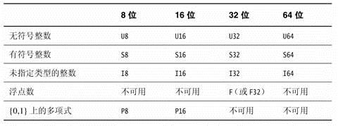
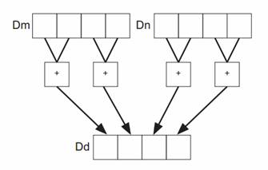
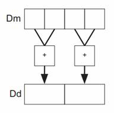
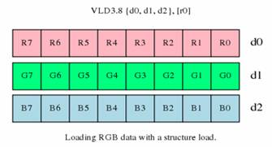
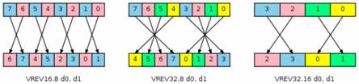
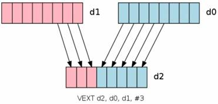
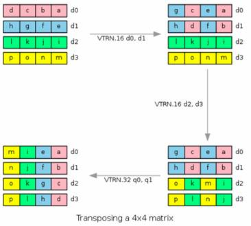
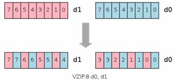
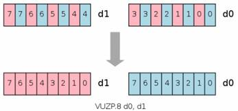
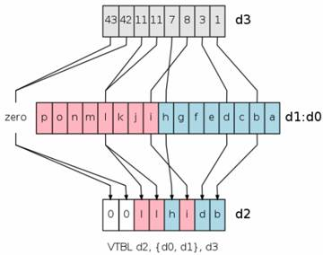

## ARM和NEON指令

 https://blog.csdn.net/chshplp_liaoping/article/details/12752749 

 在移动平台上进行一些复杂算法的开发，**一般需要用到指令集来进行加速**。目前在移动上使用最多的是ARM芯片。 

ARM是微处理器行业的一家知名企业，其芯片结构有：armv5、armv6、armv7和armv8系列。芯片类型有：**arm7、arm9、arm11、cortex**系列。指令集有：**armv5、armv6和neon指令**。关于ARM到知识参考：http://baike.baidu.com/view/11200.htm

最初的ARM指令集为通用计算型指令集，**指令集都是针对单个数据进行计算，没有并行计算到功能**。随着版本的更新，后面逐渐加入了一些**复杂到指令以及并行计算到指令**。而NEON指令是**专门针对大规模到并行运算而设计**的。 

 NEON 技术可加速多媒体和信号处理算法（如视频编码/解码、2D/3D 图形、游戏、音频和语音处理、图像处理技术、电话和声音合成），其性能至少为ARMv5 性能的3倍，为 [ARMv6](http://www.arm.com/zh/products/processors/instruction-set-architectures/index.php) SIMD性能的2倍 

如何才能快速到写出高效的指令代码？这就需要对各个指令比较熟悉，知道各个指令的使用规范和使用场合。

 ARM指令有16个32位通用寄存器，**为r0-r15**，其中r13为堆栈指针寄存器，**r15为指令计算寄存器**。实际可以使用的寄存器**只有14个**。**r0-r3一般作为函数参数使用**，函数返**回值放在r0中**。若函数参数超过4个，**超过**到**参数压入堆栈**。 

 **NEON指令，目前使用较多。而且使用难度也较大**

 **NEON的寄存器：** (见笔记 ARM_NEON_SIMD)

 有16个128位四字到寄存器Q0-Q15，32个64位双子寄存器D0-D31，两个寄存器是重叠的，在使用到时候需要特别注意，不小心就会覆盖掉。 

 **NEON的数据类型：** 

 注意数据类型针对到时操作数，而不是目标数，这点在写的时候要特别注意，很容易搞错，尤其是对那些长指令宽指令的时候，因为经常Q和D一起操作。 

 **NEON中的正常指令、宽指令、窄指令、饱和指令、长指令** 

**正常指令**：生成大小**相同且类型通常与操作数向量相同**到结果向量

**长指令**：对双字向量操作数执行运算，生产四字向量到结果。**所生成的元素一般是操作数元素宽度到两倍，并属于同一类型。L标记**，如VMOVL。

**宽指令**：一个双字向量操作数和一个四字向量操作数执行运算，生成四字向量结果。W标记，如VADDW。

**窄指令**：四字向量操作数执行运算，并生成双字向量结果，**所生成的元素一般是操作数元素宽度的一半**。**N标记，**如VMOVN。

饱和指令：当**超过数据类型指定到范围则自动限制在该范围内**。Q标记，如VQSHRUN

**什么是立即数**：

汇编语言中操作数有三种：**寄存器操作数、存储器操作数和立即数。**
**其中立即数相当于高级语言中的常量**（常数），**它是直接出现在指令中的数**，不用存储在寄存器或存储器中的数，如指令ADD AL,06H中的06H即为立即数。 

###  **NEON常见指令** 

####  **复制指令：** 

 **VMOV**： 

**两个arm寄存器和d之间**

vmov d0, r0, r1：将r1的内容送到**d0到低半部分**，r0的内容送到**d0到高半部分**

vmov r0, r1, d0：**将d0的低半部分送到r0，d0的高半部分内容送到r**1

**一个arm寄存器和d之间**

vmov.U32 d0[0], r0：将r0的内容送到d0[0]中，d0[0]指d0到低32位

vmov.U32 r0, d0[0]：将d0[0]的内容送到r0中

**立即数**： 

 vmov.U16 d0, #1：将立即数1赋值给d0的每个16位 

 vmov.U32 q0, #1：将立即数1赋值给q0的每个32位 

 **长指令：**

VMOVL：d赋值给q 

vmovl.U16 q0, d0：将d0的每个16位数据赋值到q0的每个32位数据中 

 **窄指令**：

VMOVN：q赋值给d 

 vmovn.I32 d0, q0：将q0的每32位数据赋值到q0的每16位数据中 

**饱和指令：**

VQMOVN等，饱和到指定的数据类型 

  vqmovun.S32 d0, q0：将q0到每个32位移动到d0中到每个16位中，范围是0-65535 

**VDUP：**

VDUP.8 d0, r0：将r0复制到d0中，8位

VDUP.16 q0, r0：将r0复制到q0中，16位

VDUP.32 q0, d2[0]：将d2的一半复制到q0中

VDUP.32 d0, d2[1]：将d2的一半复制到d0中

注意是vdup可以将r寄存器中的内容复制到整个neon寄存器中**，不能将立即数进行vdup，立即数只能用vmov**

####  **逻辑运算**

 VADD：按位与；VBIC：位清除；VEOR：按位异或；VORN：按位或非；VORR：按位或 

####  **移位指令：** 

VSHL：左移、VSHLL：左移扩展、VQSHL：左移饱和、VQSHLU：无符号左移饱和扩展

VSHR：右移、VSHRN：右移窄、VRSHR：右移舍入、VQSHRUN：无符号右移饱和舍入

####  **通用算术指令：** 

VABA：绝对值累加、VABD：绝对值相加、VABS：绝对值、VNEG：求反、VADD、VADDW、VADDL、VSUB、VSUBL、VSUBW：加减

VPADD：将两个向量的相邻元素相加

如VPADD.I16 {d2}, d0, d1

 VPADDL：VPADDL.S16 d0, d1 

 VMAX：最大值，VMIN：最小值 

 VMUL、VMULL、VMLA（乘加）、VMLS（乘减）

####  **加载存储指令** 

 **VLD和VST** 

 **VREV反转元素指令**： 

​		

 **VEXT移位指令**： 

 **VTRN转置指令：可以用于矩阵的转置** 

​					

 **VZIP指令：压缩，类似交叉存取** 

 **VUZP指令：解压操作，类似交叉存取** 

 **VTBL查表指令：从d0，d1中查找d3中的索引值，如果找到则取出，没有找到则为0，存入d2中** 

### 需要注意的地方

    load数据的时候，第一次load会把数据放在cache里面，只要不超过cache的大小，下一次load同样数据的时候，则会比第一次load要快很多，会直接从cache中load数据，这样在汇编程序设计的时候是非常需要考虑的问题。
    
     如：求取一个图像的均值，8*8的窗口，先行求和，然后列求和出来均值，这时候会有两个函数，数据会加载两遍，如果按照这样去优化的话则优化不了多少。如果换成上面这种思路，先做行16行，然后再做列，这样数据都在cache里面，做列的时候load数据会很快。

   在做neon乘法指令的时候会有大约2个clock的阻塞时间，如果你要立即使用乘法的结果，则就会阻塞在这里，在写neon指令的时候需要特别注意。乘法的结果不能立即使用，可以将一些其他的操作插入到乘法后面而不会有时间的消耗。

如：vmul.u16 q1, d3, d4 

         vadd.u32 q1, q2, q3

此时直接使用乘法的结果q1则会阻塞，执行vadd需要再等待2个clock的时间

使用饱和指令的时候，如乘法饱和的时候，在做乘法后会再去做一次饱和，所以时间要比直接做乘法要慢。

如：  vmul.u16 q1, d3, d4

          vqmul.u32 q1, q2, q3

后一个的时间要比第一个的时间要久。

在对16位数据进行load或者store操作的时候，需要注意的是字节移位。比如是16位数据，则load 8个16位数据，如果指定寄存器进行偏移，此时需要特别注意。

例如：vld1.64 {d0}, [r0], r1

