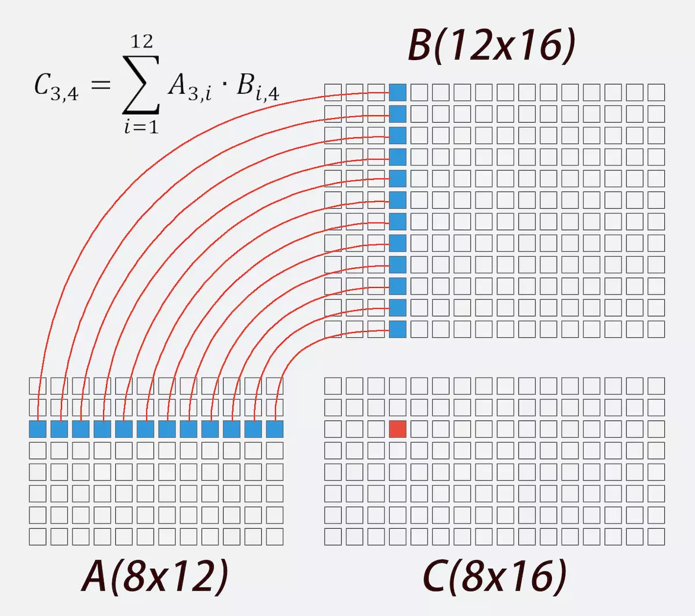
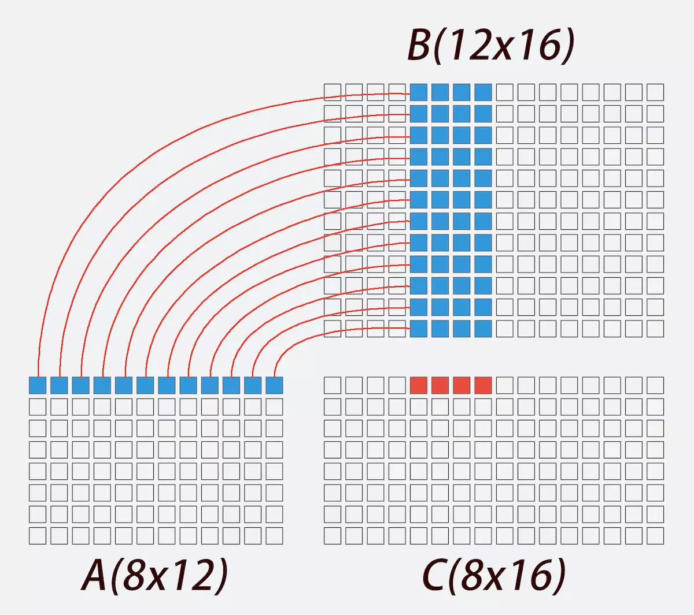
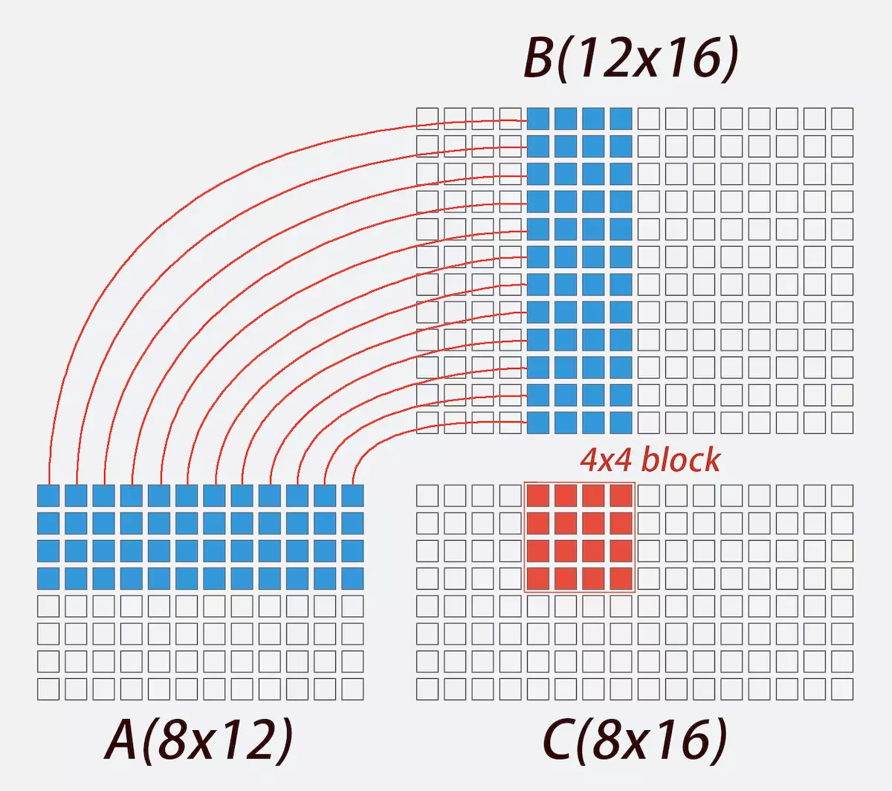

## 矩阵


## c在计算机上实现矩阵乘法

 https://www.jianshu.com/p/68879baa7c1f?from=timeline&isappinstalled=0 



首先回忆一下我们怎么笔算两个矩阵相乘。假设我们有一个8x12的A矩阵，一个12x16的矩阵B，他俩相乘，得到8x16的矩阵C。我们会遍历C矩阵的每一个位置，比如当我们想求C(3,4)这个位置的值，如上图所示，应该取A矩阵的第3行和B矩阵的第4列，求这两个向量的内积，也就是把他俩各自的12个元素两两相乘然后相加：

```c++
C[2][3] = 0;
for (int k = 0; k < 12; k++) {
    C[2][3] += A[2][k] * B[k][3]
}
```

 整个矩阵相乘即是： 

```c++
memset(C, 0, 8 * 16 * sizeof(float));
for (int i = 0; i < 8; i++) {
    for (int j = 0; j < 16; j++) {
        for (int k = 0; k < 12; k++) {
            C[i][j] += A[i][k] * B[k][j];
        }    
    }
}
```

 这就是我们熟知的最普通但也最万能的公式了。如果这活交给计算机来做，跟我们笔算有什么不一样？ 

## SIMD指令

现在不少CPU采用了**单指令多数据技术(SIMD)，**一次可以对128位二进制数据做一个相同操作。这就是说，过去我们的代码，比如`C[i][j] += A[i][k] * B[k][j];`，**每次运算只操作一个32位的数据(float)；但现在用上SIMD技术，比如ARM芯片的NEON指令**：

```cpp
float32x4_t v1 = (float32x4_t) { 0.0f,  1.0f,  2.0f,  3.0f};
float32x4_t v2 = (float32x4_t) {-0.0f, -1.0f, -2.0f, -3.0f};
float32x4_t v3 = vaddq_f32(v1, v2);    // v3 = { 0.0f,  0.0f,  0.0f,  0.0f}
float32x4_t v4 = vmulq_f32(v1, v2);    // v4 = { 0.0f, -1.0f, -4.0f, -9.0f}
```

`float32x4_t`就是一个由**4个32位的float**组成的数据类型，对它做一次操作，4个float都被用到。`vaddq_f32`函数让CPU只需要**1次**运算，就能算出`v1`和`v2`的**4个**对应元素相加的结果，然后存到`v3`里；`vmulq_f32`函数同样只需要**1次**运算，就能得到`v1`和`v2`对应元素相乘的结果。

## 多线程并行计算

矩阵乘法有一个特点：对于8x16的C矩阵，假设我们有8x16个人，他们每个人负责算C矩阵一个元素的值，那么他们的任务将是**相互独立、互不影响**的，因为他们只需要在同一块内存上取数据，然后各自算各自的，算完了再写到不同位置上去。有些人算得快，有些算得慢；有些马上开始算，有些睡了一天才开始。但这些都**不会影响最终结果的正确性**，毕竟有独立性。

现在把人换成CPU的核。假设它有8x16个核，每个核各跑1个线程，就可以让每个线程负责算C矩阵的一个元素；假设它只有2个核、2个线程，那么每个线程负责算4x16个元素，或者让一个线程只算1个元素、另一个线程算8x16-1个元素，最后的结果都是对的。至于算得快不快，就看线程池任务调度合理不合理了。


总之，计算机可以**并行地**算矩阵乘法。于CPU而言，可以在它的每一个核上创建一个线程，哪个线程闲着就给它派个独立的小任务，所有小任务做完了矩阵乘法也就算好了。如果是GPU，它可能有成百上千个核，那更得把任务拆散了派发下去。


## 算法怎么实现

请牢记，当我们在计算机上做矩阵乘法的时候，一是可以用**SIMD指令**（比如ARM芯片的NEON），在同样的时间内多算几个数；二是可以在多核心的CPU上用**多个线程并行计算**，当然用GPU就更棒了。接下来就看算法怎么写。

因为NEON指令集其他函数没有 那么顾名思义，后文中我们将沿用其数据类型float32x4_t，但不再直接用其函数名。现在定义以下顾名思义的函数：

```cpp
float32x4_t vget(float *src);
float32x4_t vdup(float num);
void write(float *dst, float32x4_t vec);
float32x4_t vadd(float32x4_t v1, float32x4_t v2);
float32x4_t vmul(float32x4_t v1, float32x4_t v2);
void svv_mul_add(float32x4_t v0, float32x4_t v1, float32x4_t v2, float s1);
void vvv_mul_add(float32x4_t v0, float32x4_t v1, float32x4_t v2, float32x4_t v3);
```


`vget`函数：从地址`src`那里**取4个**float，组成一个float32x4_t并返回

 `vdup`函数：**直接输入**一个float，把它**复制粘贴4次**，组成一个float32x4_t并返回

 `write`函数：把一个float32x4_t写到地址`dst`去，相当于一次写入4个float

 `vadd`和`vmul`函数：两个函数分别返回`v1`、`v2`对应元素相加、相乘的结果

 `svv_mul_add`函数：取float32x4_t型的`v1`、`v2`和float型的`s1`，然后让`v1`的**每一个元素都乘上**`s1`，将其结果与`v2`**对应位置的元素相加**，写到同为float32x4_t 型的`v0` 

 `vvv_mul_add`函数：取float32x4_t型的`v1`、`v2`和`v3`，然后让`v1`和`v2`**每一个对应元素相乘**，再与`v3`的**每一个对应元素相加**，写到同为float32x4_t 型的`v0`

（以上函数对应的NEON指令分别是`vld1q_f32`、`vdupq_n_f32`、`vst1q_f32`、`vaddq_f32`、`vmulq_f32`、`vfmaq_lane_f32`和`vfmaq_f32`；在其他指令集中应该也有对应的函数）




 如上图所示，如果我们要求C(1,5)到C(1,8)这**4个点**的值，就不再需要4x12个循环，而只需要12个。第一种写法如下 

```c++
void svv_mul_add(float32x4_t v0, float32x4_t v1, float32x4_t v2, float s1);
取float32x4_t型的v1、v2和float型的s1，然后让v1的每一个元素都乘上s1，将其结果与v2对应位置的元素相加，写到同为float32x4_t 型的v0 
    

float32x4_t ret = vdup(0.0f);
for (int k = 0; k < 12; k++) {
    svv_mul_add(ret, A[0][k], vget(&B[k][4]), ret);
}
write(ret, &C[0][4]);
```

 同样也可以用`vvv_mul_add`函数： 

```c++
float32x4_t ret = vdup(0.0f);
for (int k = 0; k < 12; k++) {
    vvv_mul_add(ret, vdup(A[0][k]), vget(&B[k][4]), ret);
}
write(ret, &C[0][4]);
```

这样我们需要for循环执行的次数就变成原来的1/4。不过，试想接下来如果我们要求C(2,5)到C(2,8)这4个点的值，就又需要一个for循环，重新取一遍B矩阵第5到第8列的所有值，与A矩阵第二列相乘。这个取值也是有时间成本的，应当尽量避免。那我们不妨这样:



```c++
float32x4_t vc0 = vdup(0.0f);
float32x4_t vc1 = vdup(0.0f);
float32x4_t vc2 = vdup(0.0f);
float32x4_t vc3 = vdup(0.0f);

for (int k = 0; k < 12; k++) {
    float32x4_t vb = vget(&B[k][4]);

    vvv_mul_add(vc0, vdup(A[0][k]), vb, vc0);
    vvv_mul_add(vc1, vdup(A[1][k]), vb, vc1);
    vvv_mul_add(vc2, vdup(A[2][k]), vb, vc2);
    vvv_mul_add(vc3, vdup(A[3][k]), vb, vc3);
}

write(vc0, &C[0][4]);
write(vc1, &C[1][4]);
write(vc2, &C[2][4]);
write(vc3, &C[3][4]);
```

改写后的代码，for循环会取遍A矩阵第1到第4行、B矩阵第5到第8列的所有值，算出C矩阵红色区域内的16的元素。后文中我会把这样的情况叫做**每次算出C矩阵一个4x4的块(block)**。这样改写并不会减少乘法和加法的计算次数，但能把对B矩阵取值的次数减少到原来的1/4，**因为每次取出来的值都被用了4次**。


