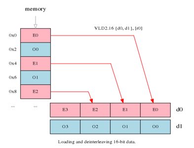
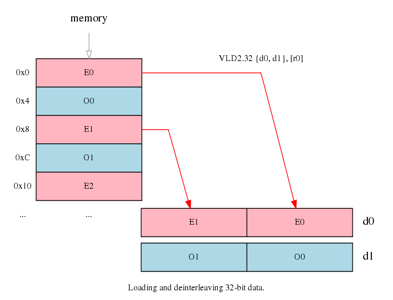

###  NEON 概述：

 https://lazybing.github.io/blog/2019/01/19/neon-technology-overview/ 

ARM NEON 技术是针对`Arm Cortex-A/R52`系列处理器的一种高级 SIMD 架构扩展。NEON 技术在 Armv7-A 和 Armv7-R 架构时开始引入，现在同样是 Armv8-A 和 Armv8-R 架构的扩展。 

 NEON 技术是一个打包的 SIMD 架构**。NEON 寄存器是相同数据类型的向量元素，它可以支持多种数据类型**。下表描述了不同架构版本支持的数据类型： 

|                |      Armv7-A/R      |         Armv8-A/R          |          Armv8-A           |
| :------------: | :-----------------: | :------------------------: | :------------------------: |
|                |                     |                            |                            |
| Floating point |       32-bit        |       16-bit*/32-bit       |   16-bit*/32-bit/64-bit    |
|    Integer     | 8-bit/16-bit/32-bit | 8-bit/16-bit/32-bit/64-bit | 8-bit/16-bit/32-bit/64-bit |

NEON 指令针对向量中的所有通道执行相同的操作，操作的个数会根据不同数据类型而不同。NEON 指令允许下面的类型：

- 16x8-bit, 8x16-bit, 4x32-bit, 2x64-bit整形操作
- 8x16-bit*, 4x32-bit, 2x64-bit** 浮点型操作

其中`*`代表只存在于 Armv8.2-A 架构中，`**`代表只存在于 Armv8-A/R 架构中。

NEON 技术也能够支持多个指令并行发布。

### 如何使用 NEON

 NEON 的使用方式有多种，比如使用 NEON 库、编译器的 auto-vectorization 功能、NEON intrinsics（内联函数）、NEON 汇编代码。 关于 NEON 编程的详细信息可以参考[NEON 编程指南](https://static.docs.arm.com/den0018/a/DEN0018A_neon_programmers_guide_en.pdf?_ga=2.112843328.535197283.1547875098-60705264.1529324001). 

### NEON 库

 利用 NEON 的最简单的方式就是使用**已经使用了 NEON 的开源库。** 

#### 用于机器学习和计算机视觉的 Arm 计算库

arm 计算库的目标是对于图像处理、计算机视觉和机器学习，它包含一些列针对 Arm CPU 和 GPU 架构的低级优化。更多信息可以访问[compue-library](https://developer.arm.com/technologies/compute-library).

Ne10 是一个开源的 C 库，由 arm 公司在 github 上维护，它包含了一组最常用的功能，这些功能都已经为 arm 做了专项优化。Ne10 是一个模块化结构，包含了很多小的库，目前包含的主要功能有：

|                      |                             |                            |                     |
| :------------------: | :-------------------------: | :------------------------: | :-----------------: |
|    Math functions    | Signal Processing functions | Image processing functions |  Physics functions  |
|      Vector Add      |   Floating & Fixed Point    |        Image Resize        | Collision Detection |
|      Matrix-Add      |   Complex-to-Complex FFT    |        Image Rotate        |                     |
|   Vector Subtract    |   Floating & Fixed Point    |                            |                     |
| Vector Subtract From |     Real-to-Complex FFT     |                            |                     |
|   Matrix Subtract    |         FIR Filters         |                            |                     |

 libyuv 是一个开源项目库，它包含了 YUV 缩放和转换功能。 

 skia 库是一个针对 2D 图像的开源库，用作 谷歌 Chrome 和 Chrome OS, Android、Mozilla Firefox 和 Firefox OS 以及其他许多产品的图形引擎。 

### AutoVectorization（自动向量化）

auto-vectorization 特性是由 arm 编译器支持的，编译器会自动利用 NEON 功能。支持该特性的编译器有:

- Arm Compiler 5
- Arm LLVM-based Compiler 6
- GCC

NEON 编程指南在 arm 编译器使用用户指导部分同样对于 NEON 选项提供了额外的指导。

## 开发工具

 `Arm DS-5 Development Studio`为基于 Arm 平台提供了用于 C/C++ 软件开发的端到端的工具套件，DS-5 从编程到调试对 NEON 架构提供了全支持。DS-5 调试器提供 NEON 指令的完整调试功能和架构寄存器的可视化。DS-5 调试器支持所有 Arm 架构配置文件和处理器 

## NEON 编程1——加载和存储

 ARM NEON 技术是 64/128 位的混合 SIMD 架构，它的设计目的就是为了提高多媒体和信号处理应用的性能，包括视频编解码、音频编解码、3D 图像、声音和图像处理。 

 我们先从操作内存开始，以及如何利用序列指令，灵活的使用 load 和 store。 

### 示例

我们从一个具体的示例开始。假设你有一个 24bit RGB 图像，像素在内存中的排列格式为 R,G,B,R,G,B…，假设你想要将其中的 R 和 B 进行交换，该如何利用 NEON，是的操作更加高效呢？

采用简单的线性 load 指令从内存中复制到寄存器里面，然后进行R/B 调换操作，会比较繁琐。示例如图

基于上图中的输入，进行分割、移位、合并这种方法去交换通道会很麻烦，效率低下。

NEON 针对此种应用场景提供了结构化的加载和存储指令，它们会从内存中加载数据的同时将数据分发到不同的寄存器。如上面例子中，VLD3 指令可以分别将加载的 R/G/B数据分别放到三个不同的寄存器中。

 现在，只要交换R/B寄存器的内容(VSWP d0, d2),之后用类似的存储指令 VST3 将数据写会内存中即可。 

### 技术细节

#### 概述

 NEON **结构化加载指令从内存中读取数据**进入 64 位 NEON 寄存器，可以选择是否交错读取；同样的，**存储指令将寄存器中的数据可以交错写回到内存中**。 

#### 语法

 **结构化加载和存取指令的语法**结构有 5 部分组成。 

- 指令助记符，**VLD 用于加载**，VST 用于存储。
- 交错存取的模式，此数字指定**了相关元素之间的距离。**
- 访问的元素类型，该类型指定了**元素的位宽**。
- 需要读取或者写入的**寄存器集合**，**最大为4**， 取决于交错存取的模式。
- ARM 地址寄存器，**包含需要访问的内存地址**。

#### 交错存取模式x

NEON 指令能够加载和存储数据并以交错方式加载或存储1-4个相同位宽的元素，NEON 支持8、16、32bit的交错存取元素。

- VLD1 是最简单的一种形式，该指令能从内存中线性加载数据到1-4个寄存器中，一般用于无交错存取的数据处理。
- VLD2 可以从内存中加载数据到 2 或 4 个寄存器中，将交错的奇数和偶数项的数据分别加载到不同的寄存器中，一般用于立体声的左右声道的分离。
- **VLD3 加载交错距离为 3 的数据到 3 个寄存器中，一般用于图像中 RGB 通道的分离**。
- VLD4 加载交错距离为 4 的数据到 4 个寄存器中，一般用于图像中 ARGB 通道的分离。

存储指令类似加载指令，但是在写入到内存之前就已经完成了数据元素交错。

#### 元素类型

 **交错元素的存取规则**取决于指令本身。例如，使用 VLD2.16 加载数据，完成操作后，共加载 8 个 16bit 的元素，其中偶数项元素加载到第一个寄存器，奇数项元素加载到第二个寄存器中。 

 元素大小变成 32 之后，加载同样大小的数据(4x32),然而每个寄存器中只有2个元素(2x32)，与 VLD2.16 一样，VLD2.32 同样是偶数项元素加载到第一个寄存器中，奇数项元素加载到第二个寄存器中。 

元素大小还会影响字节顺序，一般来讲，如果你是在存取指令中指定了正确的元素大小，从内存中读取的字节顺序将符合你的语气，并且相同的代码能在大端或者小端系统上运行良好。

最后，元素大小对于指针对齐也有一定的影响，指针地址对齐到元素大小将具有更好的性能，例如，**当加载 32 位的元素时，内存首地址最小要对齐 32 位**。

#### 单个或多个元素(Sigle or Multiple Elements)

 除了一次加载多个元素外，结构化的加载指令还能够一次从内存中读取一个元素，并且交错的放到不同的寄存器中，或者是放到寄存器的所有通道中，或者是放到寄存器的单个通道，其他通道不受影响。 

 后面的描述对于从散乱的内存中构造出一个 vector 比较有用。 

 存储指令和读取指令类似。 

