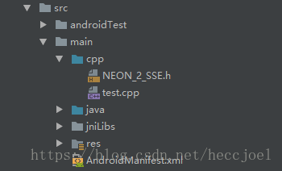
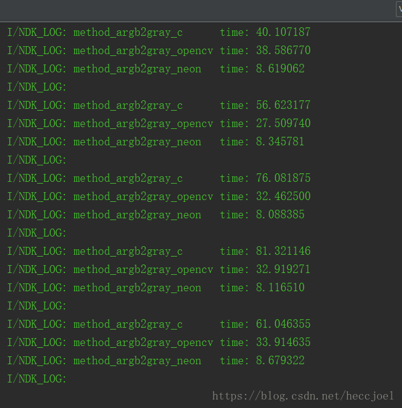

## android平台的neon优化策略

 目前市面上主流的旗舰android手机搭载的Soc都是64位的CPU，常见的armv7指令集的公版架构如Cortex-A8，Cortex-A9，Cortex-A15，常见的armv8指令集的公版架构如Cortex-A53，Cortex-A57，Cortex-A72，Cortex-A73。arm架构的CPU从armv7a开始已经支持neon（可选项），从而实现并行计算功能。armv8a还具备32个128neon寄存器，并且支持双精度浮点数 


| **armv6**                   | **ARMv7-A NEON**                | ARMv8-A AArch64 NEON                                       |
| --------------------------- | ------------------------------- | ---------------------------------------------------------- |
| 在32位通用ARM寄存器上运行   | 独立寄存器组，32x64位NEON寄存器 | 独立寄存器组，32x128位NEON寄存器                           |
| 8位/ 16位整数               | 8/16/32/64位整数,单精度浮点     | 8/16/32/64位整数,单精度浮点,双精度浮点，它们都符合IEEE标准 |
| 每条指令的2x16位/ 4x8位操作 | 每条指令最多可执行16x8位操作    | 每条指令最多可执行16x8位操作                               |

 **neon是一种SIMD（单指令多数据）指令集，其效率相当于汇编**，**用于arm cpu平台的优化，**在音视频、图形图像处理领域性能提升较大。类似的x86平台的cpu也有相关的指令集SSE，两者可以互相转化。 


```cmake
cmake_minimum_required(VERSION 3.4.1)

#add neon property
if((${ANDROID_ABI} STREQUAL "armeabi-v7a") OR
    (${ANDROID_ABI} STREQUAL "arm64-v8a"))
#如果cpu类型为armeabi-v7a或armeabi-v7a，在使用到neon函数的文件添加neon支持
    set(neon_SRCS src/main/cpp/test.cpp)
    set_property(SOURCE ${neon_SRCS}
                APPEND_STRING PROPERTY COMPILE_FLAGS " -mfpu=neon")
    add_definitions("-DHAVE_NEON=1")#定义HAVE_NEON宏

elseif(${ANDROID_ABI} STREQUAL "x86")
#如果cpu类型为x86，添加sse flag
    set(neon_SRCS test.cpp)
    set_property(SOURCE ${neon_SRCS} APPEND_STRING PROPERTY COMPILE_FLAGS
                "-mssse3 -Wno-unkown-attributes 
                         -Wno-deprecated-declarations 
                         -Wno-constant-concersion 
                         -Wno-static-int-inline")
    add_definitions(-DHAVE_NEON_X86=1 -DHAVE_NEON=1)#定义HAVE_NEON_X86，HAVE_NEON宏
else ()
    set(neon_SRCS)
endif()

add_library(neondemo
            SHARED
            src/main/cpp/test.cpp )

target_link_libraries( neondemo
                       log
                       jnigraphics#naitve需要用到android sdk中的bitmap类，所以添加此系统库
                       
```


 x86平台不直接支持neon指令，需要将其转为sse指令，就要用到NEON_2_SSE.h,最新的下载地址：  

 https://github.com/intel/ARM_NEON_2_x86_SSE。  




 用纯C语言，opencv函数，neon做三套代码，计算图片色彩空间转换的耗时。  

核心函数：

```c++
#include <jni.h>
#include <opencv2/opencv.hpp>
#include <android/bitmap.h>
#include <android/log.h>

#if  HAVE_NEON && HAVE_NEON_X86
#include "NEON_2_SSE.h"
#elif HAVE_NEON
#include <arm_neon.h>
#endif

#define  LOG_TAG    "NDK_LOG"
#define  LOGI(...)  __android_log_print(ANDROID_LOG_INFO,LOG_TAG,__VA_ARGS__)
#define  LOGE(...)  __android_log_print(ANDROID_LOG_ERROR,LOG_TAG,__VA_ARGS__)

using namespace cv;

//纯C函数
void method_argb2gray_c(AndroidBitmapInfo info, void *pixels) {
    // rgb转灰度值公式
    // Gray = (R*38 + G*75 + B*15) >> 7
    cv::TickMeter tm1;
    tm1.start();
    uint32_t *pixel = NULL;
    int a = 0, r = 0, g = 0, b = 0;
    int rows=info.height;
    int cols=info.width;

    for (int y = 0; y < rows; ++y) {
        for (int x = 0; x < cols; ++x) {
            pixel = (uint32_t *) pixels + info.width * y + x;
            a = (*pixel & 0xFF000000) >> 24;
            r = (*pixel & 0x00FF0000) >> 16;
            g = (*pixel & 0x0000FF00) >> 8;
            b = (*pixel & 0x000000FF) >> 0;
            int gray = (r * 38 + g * 75 + b * 15) >> 7;

            *pixel = ((a << 24) | (gray << 16) | (gray << 8) | gray);
        }
    }
    tm1.stop();
    LOGI("method_argb2gray_c      time: %lf", tm1.getTimeMilli());
}

//opencv提供的函数
void method_argb2gray_opencv(AndroidBitmapInfo info, void *pixels) {

     TickMeter tm2;
     tm2.start();
    Mat m_src(info.height, info.width, CV_8UC4, pixels);
    Mat m_gray, m_res;
    cvtColor(m_src, m_gray, COLOR_BGRA2GRAY);
    cvtColor(m_gray, m_res, COLOR_GRAY2RGBA);
    memcpy(pixels, m_res.data, info.height * info.width * 4);

    tm2.stop();
    LOGI("method_argb2gray_opencv time: %lf", tm2.getTimeMilli());
}

//neon函数
void method_argb2gray_neon(AndroidBitmapInfo info, void *pixels) {
    // Gray = (R*38 + G*75 + B*15) >> 7
    TickMeter tm3;
    tm3.start();
    unsigned short *dst = (unsigned short *) pixels;
    unsigned char *src = (unsigned char *) pixels;
    uint8x8_t r = vdup_n_u8(38);
    uint8x8_t g = vdup_n_u8(75);
    uint8x8_t b = vdup_n_u8(15);
    uint16x8_t alp = vdupq_n_u16(255 << 8);

    uint16x8_t temp;
    uint8x8_t gray;
    uint8x8x4_t argb;
    uint16x8_t hight;
    uint16x8_t low;
    uint16x8x2_t res;
    int i, size = info.height * info.width / 8;

    for (i = 0; i < size; ++i) {

        //获取r、g、b值，计算灰度值
        argb = vld4_u8(src);
        temp = vmull_u8(argb.val[1], r);
        temp = vmlal_u8(temp, argb.val[2], g);
        temp = vmlal_u8(temp, argb.val[3], b);
        gray = vshrn_n_u16 (temp, 7);
        src += 8 * 4;

        //赋值4通道argb
        hight = vorrq_u16(alp, vmovl_u8(gray));
        low = vorrq_u16(vshlq_n_u16(vmovl_u8(gray), 8), vmovl_u8(gray));
        res = vzipq_u16(low, hight);
        vst1q_u16(dst, res.val[0]);
        dst += 8;
        vst1q_u16(dst, res.val[1]);
        dst += 8;

    }
    tm3.stop();
    LOGI("method_argb2gray_neon   time: %lf", tm3.getTimeMilli());
    LOGI(" n");
}


extern "C"
JNIEXPORT jint JNICALL
Java_com_spiropad_neondemo_MainActivity_processImg(JNIEnv *env, jobject instance, jobject bitmap) {

    //图片信息
    AndroidBitmapInfo info;
    memset(&info, 0, sizeof(info));
    AndroidBitmap_getInfo(env, bitmap, &info);
    if (info.width <= 0 || info.height <= 0 ||
        (info.format != ANDROID_BITMAP_FORMAT_RGBA_8888)) {
        return -1;
    }

    //像素数据指针
    void *pixels = NULL;
    int res = AndroidBitmap_lockPixels(env, bitmap, &pixels);
    if (pixels == NULL) {
        return -2;
    }

    method_argb2gray_c(info, pixels);

    method_argb2gray_opencv(info, pixels);

#if HAVE_NEON
    method_argb2gray_neon(info, pixels);
#endif

    AndroidBitmap_unlockPixels(env, bitmap);

    return 0;
}
```



**相比纯C函数，opencv的函数的运行时间提高了1.9倍，neon函数的运行时间提高了7.5倍！优化效果很好。**

注：针对x86平台，neon函数转化sse函数的优化效果不佳甚至不如纯C代码实现，作者日后在做研究。


